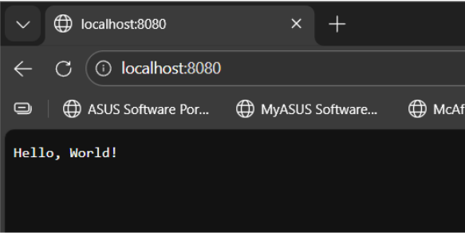
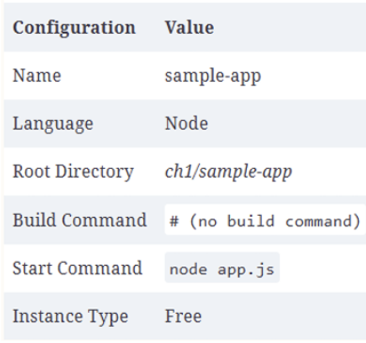
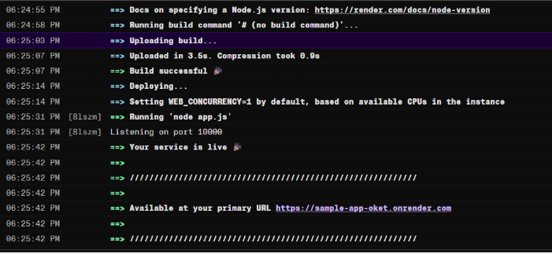

# Lab 1: 

## Introduction 

Dans ce premier lab, nous avons découvert les bases du déploiement d’une application web.
 L’objectif était de comprendre :
Comment exécuter une application localement

Ce qu’est un serveur

La différence entre un déploiement local et un déploiement dans le cloud

La différence entre PaaS (Platform as a Service) et IaaS (Infrastructure as a Service)

Nous avons utilisé une application simple en Node.js affichant "Hello, World!" afin de nous concentrer sur les concepts d’infrastructure plutôt que sur le code applicatif.

## Exécution de l'application en local 

Tout d’abord, nous allons créer l’arborescence suivante : 

devops_base/
 └── ch1/
      └── sample-app/
           └── app.js

L’application Node.js écoute sur un port (8080 par défaut) et renvoie "Hello, World!" à chaque requête.

Ensuite, on ouvre dans le navigateur l'URL suivante : **http://localhost:8080** et on voit bien : "Hello, World!"

## Déploiement de l’application via une plateforme PaaS

Après avoir créé un compte sur Render.com, on déploie un Web Service en utilisant mon repo : 

Ensuite, on configure l’application comme ci-dessous :

On déploie l'application web : 

On lance dans un navigateur l'URL : https://sample-app-oket.onrender.com/

et on obtient bien "Hello World!"

On remarque qu’utiliser **PaaS**  est un moyen très simple et rapide. Il n’est pas non plus nécessaire de gérer le serveur. 
Cependant, il y a des inconvénients : 
peu de contrôle
dépendant du fournisseur
Pas très flexible pour des architectures plus complexes. 

### 3. Déploiement de l’application via une infrastructure IaaS

Enfin, l’application est déployée à l’aide d’une infrastructure **IaaS (Infrastructure as a Service)**.  
Contrairement au **PaaS**, cette approche n’automatise pas le déploiement de l’application. Elle nécessite une configuration manuelle du serveur.
Une instance **EC2** est créée sur **AWS**, correspondant à un serveur virtuel distant.  
L’environnement est par la suite configuré manuellement, en particulier l’installation de **Node.js**, l’ouverture des ports réseau nécessaires et le lancement de l’application.

Afin d’automatiser le démarrage de l’application, un script de lancement appelé **user data** est utilisé.  
Grâce à ce script, l’application est automatiquement lancée au démarrage de l’instance et devient accessible via l’**adresse IP publique** du serveur.

## Conclusion : 

Ce premier lab nous a permis de comparer deux approches fondamentales du déploiement d’applications dans le cloud : le **PaaS (Platform as a Service)** et le **IaaS (Infrastructure as a Service)**.
Le **PaaS**, illustré par Render, simplifie considérablement le processus de déploiement. L’infrastructure est entièrement gérée par le fournisseur : le développeur se concentre uniquement sur le code applicatif. Cette approche est idéale pour des projets simples, des prototypes ou des applications nécessitant un déploiement rapide. Cependant, elle offre un contrôle limité sur l’environnement et peut être moins adaptée à des architectures complexes ou spécifiques.
À l’inverse, l’**IaaS**, avec AWS EC2, fournit un contrôle total sur l’infrastructure. L’utilisateur configure lui-même le serveur, le réseau, les règles de sécurité et l’installation des dépendances. Cette approche est plus flexible et mieux adaptée aux environnements de production ou aux systèmes complexes. En revanche, elle demande davantage de compétences techniques et implique un risque d’erreur plus important.
En résumé :
Le **PaaS privilégie la simplicité et la rapidité**.

Le **IaaS privilégie le contrôle et la flexibilité**.

Le choix entre ces deux modèles dépend donc des besoins du projet, du niveau de personnalisation requis et des compétences disponibles. Cette comparaison met en évidence l’importance de comprendre les différents modèles de cloud computing pour adopter la solution la plus adaptée dans un contexte DevOps.

