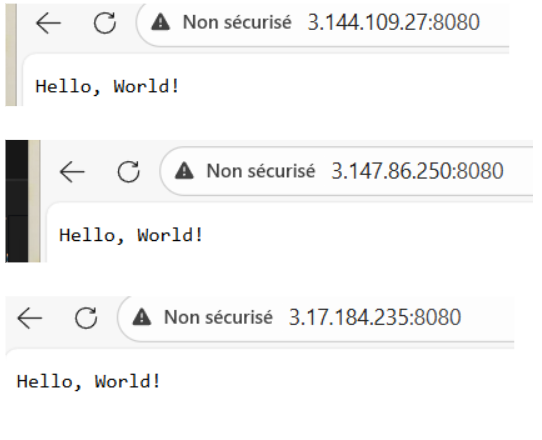
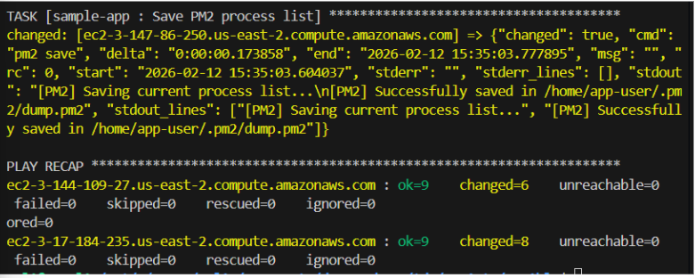
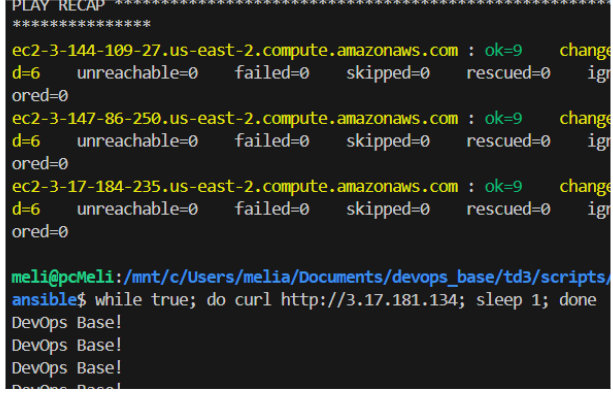

# Lab 3: 

# Intro 

Le but de ce lab est de comprendre comment on déploie des applications. On va voir trois méthodes différentes : 

- Ansible qui va nous servir à gérer des serveurs classiques. 

- Packer et OpenTofu qui vont nous servir à créer des images de serveurs déjà prêtes à l’emploi. 

- Kubernetes qui va gérer des conteneurs (Docker). L’objectif va être de voir laquelle est la plus pratique et la plus rapide. 

# Partie Ansible 

Après avoir fait la configuration on peut s’attaquer à la création de nos serveurs. 
Au lieu de cliquer partout sur la console AWS pour créer nos serveurs, on a utilisé Ansible ce qui est beaucoup plus pratique. 

On a lancé un Playbook qui a fait le travail à notre place, il a créé un Security Group pour laisser passer le trafic SSH et Web, il a ensuite généré une clé SSH pour que l’on puisse se connecter aux serveurs, et enfin il démarre les 3 instances EC2 sur AWS. 

Configuration d’un inventaire dynamique : 

Maintenant que les serveurs existent ils sont vides, et on va installer Node.js et le code dessus. 
Le problème est que l’on ne connait pas leurs adresses IP, c’est pour cela que l’on va utiliser un inventaire dynamique il va permettre de demander à AWS de donner les IPs de toutes les machines qui s’appellent sample_app_instances. 

Une fois que le code était prêt nous avons voulu lancer le playbook pour tout installer sur les serveurs cependant nous avions rencontré un problème. 

Tout d’abord Ansible n’arrivait pas du tout à se connecter aux serveurs, il nous mettait une erreur “Unreachable”. Le problème venait du fait que l’on utilisait une clé stockée dans Windows via WSL. Les permissions étaient trop ouvertes et du coup AWS refusait la connexion par sécurité si la clé n’est pas protégée. On a donc copié la clé directement dans le système de fichiers Linux et on a appliqué la commande chmod 600 et cette fois ci ça a pu fonctionné. 

Le deuxième problème et que le script plantait au moment de configurer PM2 pour que l’application se lance au démarrage du serveur. L’erreur disait que nous n’avions pas les droits, en regardant le code on a vu que le playbook essayait de lancer la commande avec l’utilisateur app-user. Cependant pour écrire dans les fichiers au démarrage du système il faut être administrateur. On a donc modifié le tasks/main.yml pour retirer l’utilisateur app-user et laisser Ansible exécuter la commande avec sudo. 

Après tout cela en relançant le playbook tout est passé au vert on a eu failed = 0. Voici en captures d’écran de ce que l’on a pu obtenir en lançant les adresses IP publiques de nos serveurs lorsque l’on lance dans le navigateur (port 8080). On remarque que l’on a bien le message Hello World. 

Load Balancer : 

Pendant la préparation de la configuration de Nginx, il y a eu une erreur au moment de lancer le playbook. On avait une tâche pour copier le fichier de configuration et on avait mis notify : restart nginx pour qu’il redémarre le service après chaque modification. 
Le problème c’est qu’Ansible disait qu’il ne trouvait pas le handler alors qu’il était écrit juste en dessous des tâches. 

Et on a pu comprendre qu’Ansible est très strict sur le rangement des fichiers quand on utilise des rôles. On ne peut pas mettre les handlers n’importe où. On a donc du créer un nouveau dossier handlers avec le fichier main.yml et on a déplacé la commande de redémarrage dans ce dernier. 

Rolling Update : 

Maintenant que le load balancer fonctionne, on a voulu tester une mise à jour de l’application. 
On a changé le message ‘hello World’ par ‘DevOps Base!’. 

On  a ensuite vérifié que la mise à jour a bien été appliquée. En lançant la boucle curl sur l’IP du Load Balancer on a pu voir que c’est maintenant le nouveau message DevOps Base! qui s’affiche. Le load balancer continue de faire son travail et de nus envoyer vers les serveurs mis à jour sans aucune erreur.

Pour conclure sur cette partie on a réussi à automatiser toute la chaîne de production. Ansible est parti de rien et a pu créer les serveurs sur AWS, installé l’application, configuré un Load Balancer Nginx et même géré une sorte de mise à jour en direct. 

# Partie 2 : VM orchestration avec Packer et OpenTofu
