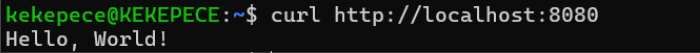
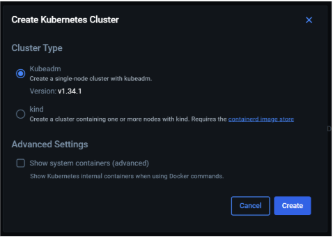
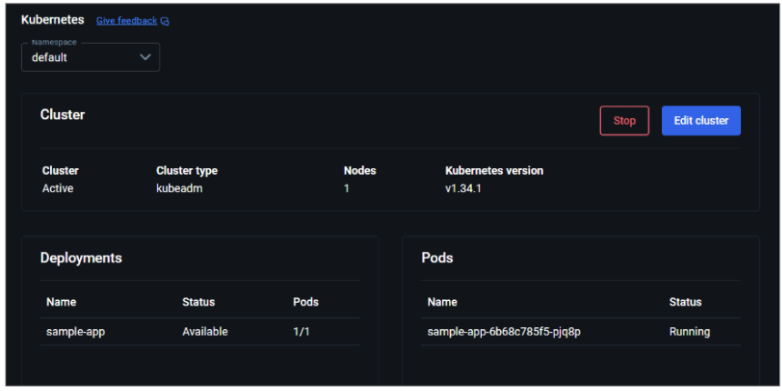
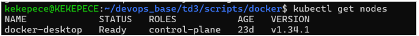
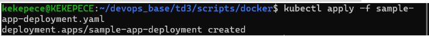
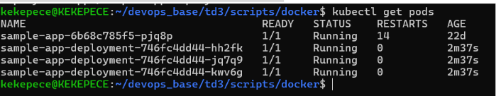
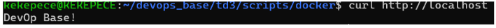

# Lab 3: 

# Intro 

Le but de ce lab est de comprendre comment on déploie des applications. On va voir trois méthodes différentes : 

- Ansible qui va nous servir à gérer des serveurs classiques. 

- Packer et OpenTofu qui vont nous servir à créer des images de serveurs déjà prêtes à l’emploi. 

- Kubernetes qui va gérer des conteneurs (Docker). L’objectif va être de voir laquelle est la plus pratique et la plus rapide. 

# Partie Ansible 

Après avoir fait la configuration on peut s’attaquer à la création de nos serveurs. 
Au lieu de cliquer partout sur la console AWS pour créer nos serveurs, on a utilisé Ansible ce qui est beaucoup plus pratique. 

On a lancé un Playbook qui a fait le travail à notre place, il a créé un Security Group pour laisser passer le trafic SSH et Web, il a ensuite généré une clé SSH pour que l’on puisse se connecter aux serveurs, et enfin il démarre les 3 instances EC2 sur AWS. 

Configuration d’un inventaire dynamique : 

Maintenant que les serveurs existent ils sont vides, et on va installer Node.js et le code dessus. 
Le problème est que l’on ne connait pas leurs adresses IP, c’est pour cela que l’on va utiliser un inventaire dynamique il va permettre de demander à AWS de donner les IPs de toutes les machines qui s’appellent sample_app_instances. 

Une fois que le code était prêt nous avons voulu lancer le playbook pour tout installer sur les serveurs cependant nous avions rencontré un problème. 

Tout d’abord Ansible n’arrivait pas du tout à se connecter aux serveurs, il nous mettait une erreur “Unreachable”. Le problème venait du fait que l’on utilisait une clé stockée dans Windows via WSL. Les permissions étaient trop ouvertes et du coup AWS refusait la connexion par sécurité si la clé n’est pas protégée. On a donc copié la clé directement dans le système de fichiers Linux et on a appliqué la commande chmod 600 et cette fois ci ça a pu fonctionné. 

Le deuxième problème et que le script plantait au moment de configurer PM2 pour que l’application se lance au démarrage du serveur. L’erreur disait que nous n’avions pas les droits, en regardant le code on a vu que le playbook essayait de lancer la commande avec l’utilisateur app-user. Cependant pour écrire dans les fichiers au démarrage du système il faut être administrateur. On a donc modifié le tasks/main.yml pour retirer l’utilisateur app-user et laisser Ansible exécuter la commande avec sudo. 

Après tout cela en relançant le playbook tout est passé au vert on a eu failed = 0. Voici en captures d’écran de ce que l’on a pu obtenir en lançant les adresses IP publiques de nos serveurs lorsque l’on lance dans le navigateur (port 8080). On remarque que l’on a bien le message Hello World. 

Load Balancer : 

Pendant la préparation de la configuration de Nginx, il y a eu une erreur au moment de lancer le playbook. On avait une tâche pour copier le fichier de configuration et on avait mis notify : restart nginx pour qu’il redémarre le service après chaque modification. 
Le problème c’est qu’Ansible disait qu’il ne trouvait pas le handler alors qu’il était écrit juste en dessous des tâches. 

Et on a pu comprendre qu’Ansible est très strict sur le rangement des fichiers quand on utilise des rôles. On ne peut pas mettre les handlers n’importe où. On a donc du créer un nouveau dossier handlers avec le fichier main.yml et on a déplacé la commande de redémarrage dans ce dernier. 

Rolling Update : 

Maintenant que le load balancer fonctionne, on a voulu tester une mise à jour de l’application. 
On a changé le message ‘hello World’ par ‘DevOps Base!’. 

On  a ensuite vérifié que la mise à jour a bien été appliquée. En lançant la boucle curl sur l’IP du Load Balancer on a pu voir que c’est maintenant le nouveau message DevOps Base! qui s’affiche. Le load balancer continue de faire son travail et de nus envoyer vers les serveurs mis à jour sans aucune erreur.

Pour conclure sur cette partie on a réussi à automatiser toute la chaîne de production. Ansible est parti de rien et a pu créer les serveurs sur AWS, installé l’application, configuré un Load Balancer Nginx et même géré une sorte de mise à jour en direct. 

# Partie 2 : VM orchestration avec Packer et OpenTofu

Tout d’abord nous allons créer une AMI immuable contenant notre application Node.js et son gestionnaire de process PM2. 

Lorsque l’on lançait le build on obtenait une erreur, en regardant la configuration  du fichier “  sample-app.pkr.hcl “ c’était la ligne “ "sudo su - app-user -c 'pm2 startup systemd -u app-user --hp /home/app-user'" “ on a donc modifié en “       "sudo env PATH=$PATH:/usr/bin pm2 startup systemd -u app-user --hp /home/app-user", cela a permis de finaliser le build avec succès.
L’image a pu ensuite être créee : 

Une fois notre AMI créer avec Packer nous sommes passés à la phase de dépliement automatisé avec OpenTofu. L’objectif étant de ne plus gérer les instances manuellement mais de déclarer notre infrastructure dans des fichiers .tf . 

On a configuré un module ASG dans le fichier main.tf . Ce module utilise l'AMI précédemment générée et un script user-data.sh pour s'assurer que l'application Node.js est lancée par PM2 dès le démarrage de chaque instance. Nous avons défini une capacité souhaitée de 3 instances (desired_capacity = 3) pour garantir la disponibilité. 

Nous avons ensuite ajouté un module ALB, contrairement à la partie Ansible où nous utilisions une IP fixe, l’ALB nous fournit un nom DNS unique. Il permet de répartir le trafic de manière équilibrée entre les 3 instances de notre ASG. 

Grâce au fichier outputs.tf , nous avons configuré OpenTofu pour qu’il nous affiche directement l’URL DNS à la fin du déploiement ce qui permet de faciliter les tests.

Egalement parfois les instances mettaient du temps à passer les Health Check d’AWS nous avons donc dû ajuster le délai d’attente wait_for_capacity_timeout = "0" pour faciliter la stabilisation. 

Pour permettre la mise à jour de notre application sans couper le service, nous avons configuré le bloc instance_refresh dans le module ASG d’OpenTofu. 

Nous avons rencontrés des problèmes lors du déploiement de tofu apply tout d’abord il a fallut ajuster le bloc instance_refresh pour inclure max_healthy_percentage ce qui permet une mise à jour progressive des instances sans interruption du service.

Nous avons modifié le fichier app.js pour changer le message de retour par “DevOps Base!”. Pour déployer ce changement, nous avons dû reconstruire une image disque complète avec Packer. Une fois qu’on a mis à jour l’ID de notre nouvelle AMI dans notre configuration OpenTofu nous avons lancé le tofu apply. Pour vérifier que le service restait disponible, j’ai exécuté une boucle curl dans le terminal. 

Pendant le déploiement, on a pu observer une phase de transition où le Load Balancer renvoyait alternativement l’ancien message (“Hello World!”) et le nouveau (“DevOps Base!”) cela permet de nous prouver que les nouvelles instances ont été intégrées progressivement, le trafic a été basculé de manière fluide et de pus on a pas d’erreurs pendant le processus. 
En résumé, OpenTofu permet de créer tout un réseau de serveurs sur AWS en lançant juste quelques commandes. C'est beaucoup plus sûr que de tout faire à la main sur la console Amazon, car on écrit tout dans des fichiers : on ne peut donc pas oublier une étape.
Le plus gros avantage qu' on a  vu, c'est la mise à jour sans coupure. On a pu changer le message de mon application et l'installer sur tous mes serveurs sans que le site ne s'arrête jamais. Les nouveaux serveurs remplacent les anciens automatiquement. Enfin, quand on n'en a plus besoin, on peut tout supprimer proprement en une seule fois, ce qui évite de payer pour rien.

# Partie 3 : Kubernetes 

Partie 3 : Kubernetes 
Dans cette troisième partie, nous allons travailler avec **Docker et Kubernetes** afin de déployer notre application sous forme de conteneur.
Contrairement aux parties précédentes où nous gérions des serveurs ou des machines virtuelles, ici Kubernetes va s’occuper de gérer des conteneurs.
L’objectif est de voir comment une application peut être déployée, répliquée et mise à jour automatiquement grâce à un orchestrateur de conteneurs.
Avant d’utiliser Kubernetes, nous avons commencé par créer une image Docker contenant notre application Node.js.
Nous avons créé un fichier Dockerfile qui :
utilise l’image officielle **node:alpine**,

copie le fichier **app.js**

expose le port **8080**,

lance l’application avec la commande node **app.js**.

Après avoir créé le fichier Dockerfile, nous avons construit l’image Docker contenant notre application Node.js à l’aide de la commande :

Cette commande permet de générer une image nommée **sample-app** avec le tag **v1**, à partir du contenu du dossier courant.

Une fois l’image construite, nous avons lancé un conteneur à partir de cette image avec :

Afin de vérifier le bon fonctionnement de l’application, nous avons utilisé la commande dans un autre terminal :

Le message **Hello, World!** est bien retourné, ce qui confirme que l’image Docker fonctionne correctement en local avant son déploiement sur Kubernetes.

Etape 2 : Création du cluster Kubernetes

Après avoir validé le bon fonctionnement de notre image Docker en local, nous avons mis en place un **cluster Kubernetes** via Docker Desktop.
Depuis l’interface Docker, nous avons sélectionné l’option **Create Kubernetes Cluster**, puis choisi le type **kubeadm**, qui permet de créer un cluster local simple composé d’un nœud unique.

Cette étape confirme que notre environnement Kubernetes local est opérationnel et prêt à accueillir notre application conteneurisée.

On vérifie que localement, kubectl a bien été créé et qu’il est prêt à l’utilisation : 

Le nœud **docker-desktop** apparaît en statut **Ready**, ce qui confirme que le cluster est actif et prêt à recevoir des déploiements.

Nous avons ensuite déployé notre application à l’aide du fichier de configuration :

Nous avons vérifié que les pods sont bien lancés avec :

Les pods apparaissent en statut **Running**, ce qui indique que les conteneurs fonctionnent correctement.

Afin de rendre l’application accessible, nous avons créé le service Kubernetes :

Le message **Hello, World!** est correctement affiché, ce qui confirme que le déploiement Kubernetes fonctionne.

Step 3 : 

Afin de tester la mise à jour de notre application, nous avons modifié le fichier app.js en remplaçant le message "Hello World!" par "DevOps Base!".
Après cette modification, nous avons reconstruit une nouvelle image Docker et mis à jour le fichier sample-app-deployment.yaml afin d’utiliser la nouvelle version de l’image.

Nous avons ensuite appliqué la mise à jour et nous utilisons la commande suivante pour suivre la progression :

Kubernetes a progressivement remplacé les anciens pods par de nouveaux, sans interruption de service.
Enfin, nous avons vérifié que la mise à jour est bien effective avec :

Le message **DevOps Base!** s’affiche correctement, ce qui confirme que la mise à jour s’est déroulée avec succès.

# Partie 4 : Severless avec AWS Lambda 

Dans cette partie nous allons explorer une approche un peu différente par rapport aux précédentes. Contrairement au déploiement par instances ou par conteneurs, ici nous allons permettre de déployer du code sans avoir à gérer l’infrastructure complexe. Ici, l’unité de base n’est plus un serveur mais une fonction (AWS Lambda) qui s’exécute uniquement lorsqu’elle est appelée. 

Tout d’abord nous avons commencé par préparer l’environnement de travail et créer le code de la fonction dans un fichier index.js . Le code est assez simple, il exporte un handler qui renvoie juste “Hello World!” avec un code de succès (200). 

Pour le déploiement, nous avons utilisé OpenTofu afin de déclarer la ressource Lambda. 
Après avoir initialisé le répertoire tofu init nous avons appliqué la configuration via tofu apply. OpenTofu s’est chargé de zipper le code source et de le téléverser sur AWS.

Pour valider le fonctionnement, nous avons utilisé la console AWS Lambda pour effectuer un test manuel. Voici ce qu’on obtient, on a bien le résultat attendu. Ici la fonction existe sur AWS mais n’est pas encore accessible via Internet c’est ce qui va être fait juste après. 

Pour rendre la fonction Lambda accessible depuis n’importe quel navigateur ou terminal nous avons ajouté un module API Gateway. Dans le fichier main.tf on a ensuite lié ce module à notre fonction via son function_arn. On a ensuite configuré deux routes pour tester la flexiblité de l’API, une route GET pour l’accès standard et une route POST/data pour simuler l’envoi de données. Ensuite grâce au fichier outputs.tf, OpenTofu nous a fourni l’URL publique générée par AWS après le tofu apply.

Ensuite on peut tester et on peut voir que ça fonctionne correctement.

On remarque que l’un des avantages majeurs est la rapidité de mise à jour, nous avons modifié le message dans index.js pour passer de Hello World à DevOps Base

Contrairement à la partie avec Packer qui demandait plusieurs minutes pour remplacer les serveurs ici la mise à jour avec tofu apply a été quasi direct. En utilisant curl sur l’URL de l’API Gateway nous avons pu confirmer que le nouveau message s’affichait immédiatement sans coupure ni délai. 
