# Lab 4 : Gestion du code, automatisation et tests

## Introduction : 

L’objectif de ce premier lab est de se familiariser avec la gestion de version, l’automatisation des builds et la mise en œuvre de tests automatisés. On ne peut pas automatiser ou déployer proprement si on ne maîtrise pas Git. 

Dans ce lab les objectifs sont de savoir maîtriser Git, de savoir utiliser GitHub comme une plateforme de revue de code et de protection de branches, de savoir configurer des scripts de build et gérer les dépendances pour rendre notre application Node.js facile à exécuter et enfin implémenter des tests unitaires et d’intégration pour s’assurer que chaque modification de code ou d’infrastructure ne détruit pas le système existant. 

## Part 1 : Contrôle de version avec Git 

Cette première partie du lab était dédiée à la prise en main de Git en local. L’objectif était de comprendre comment Git suit l’évolution des fichiers avant même de parler de partage sur le cloud. 

Tout d’abord il fallait configurer notre identité c’est une étape importante pour que chaque commit dans l’historique soit enregistré avec ces informations. 

Nous avons ensuite créé notre espace de travail et initialisé le dépôt. La commande git init a permis de créer un dossier caché .git. C’est dedans que Git stocke toute l’intelligence du versioning. 

Nous avons créé un fichier nommé example.txt. En utilisant la commande git status., on a pu observer que Git détectait le fichier mais ne le suivait pas encore. Pour l’enregistrer il a fallut d’abord le préparer avec git add puis valider cette version avec git commit -m “Initial commit”

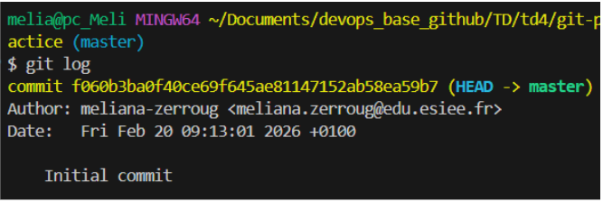

Ensuite nous avons ajouté une ligne de texte au fichier. Avant de valider ce changement nous avons utilisé git diff pour vérifier exactement ce qui avait été modifié. Cette commande est très utilis car elle affiche en vert les lignes ajoutées ce qui permet de mieux voir les erreurs avant de confirmer un commit. 

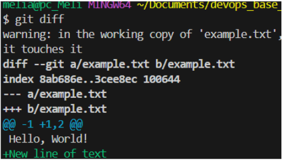

En DevOps il est important de ne pas modifier le code principal directement. Pour cela nous avons créé une branche de test appelée testing avec la commande git checkout -b testing. 
Cela a permis de pouvoir travailler de notre côté sans risquer de casser la branche principale. Une fois les modifications terminées sur cette branche, je suis revenue sur main et on a utilisé git merge testing pour fusionner les changements. 

Exercice 1 

Pour terminer nous avons réalisé les deux exercices. Tout d’abord dans ce premier exercice nous avons créé un Tag v1.0. Un tag peut être très pratique car il sert à garder un historique beaucoup plus clair. 

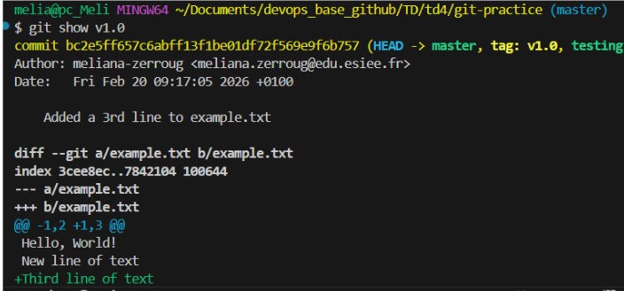

exercice 2 

Enfin, nous avons testé la commande rebase, il s’agit d’une alternative au “merge”.
Le rebase permet de réorganiser les commits pour qu’ils se suivent tous. C’est une méthode très intéressante pour que l’historique reste lisible quand on travaille à plusieurs.

## Partie 2 : Collaborer avec GitHub 

Cette deuxième partie du lab nous a permis de passer d’un travail local à un environnement collaboratif sur le cloud. L’objectif était de savoir gérer le partage de code et de mettre en place des barrières de sécurité indispensables en production. 

Après avoir créé mon dépôt sur GitHub, nous avons lié le dossier local avec la commande git remote add origin. Lors du premier push il fallait bien faire attention à bien cibler la branche main pour éviter les erreurs de correspondance entre branches. On a aussi testé la synchronisation inverse en modifiant un fichier directement sur l’interface web de GitHub, nous avons dû utiliser git pull pour ensuite pouvoir voir ces changements sur le PC. 

Ensuite au lieu de pousser les modifications sur la branche principale, nous avons créé une branche isolée (update-readme) pour ajouter un fichier README.md . Une fois poussée sur GitHub, nous avons ouvert une PR pour proposer mes changements. Cette façon de faire en devOps est très intéressante car elle permet une revue de code par les autres avant de réaliser une fusion définitive. Après avoir validé le merge sur GitHub nous avons synchronisé le dépôt local pour que la branche main soit de nouveau à jour. 

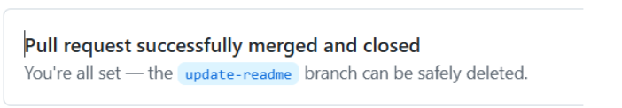

Exercices : 

Pour terminer nous avons configuré deux options de sécurité. Tout d’abord nous avons activé une règle de protection de branche sur main pour interdire les push directs et forcer le passage par une PR avec approbation. Lors de mon push suivant le terminal m’a d’ailleurs alerté que je “bypassais” cette règle en tant qu’administrateur prouvant qu’elle est bien active : 

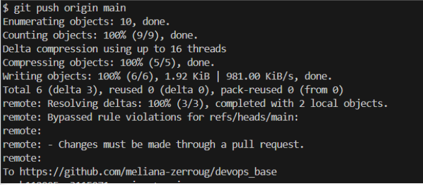

Enfin, nous avons configuré la signature des commits via une clé GPG. Cette étape permet de garantir mon identité en tant qu’auteur. Sur GitHub cela se traduit par un badge “Verified” à côté de mes commits. 

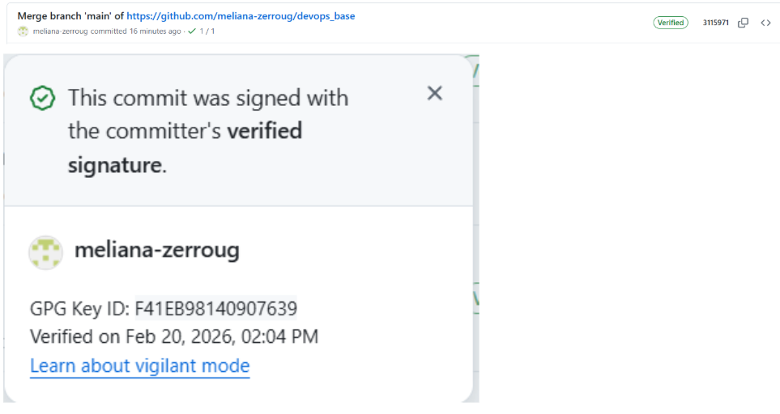

## Partie 3 : Mise en place d’un build system avec NPM 

Dans cette section, l'objectif était d'utiliser NPM (Node Package Manager) non seulement pour gérer des dépendances, mais comme un véritable outil d'automatisation (Build System) pour simplifier le cycle de développement et de déploiement.

J'ai commencé par créer notre projet en créant un dossier sample-app contenant une application Node.js simple (app.js). Après avoir initialisé le projet avec npm init -y, j'ai créé le fichier package.json pour y inclure des scripts. Le script "start": "node app.js" permet de lancer le serveur via une commande standardisée : npm start. Cette approche est importante en DevOps car elle permet à n'importe quel membre de l'équipe de lancer l'application sans connaître les détails techniques de l'exécution.

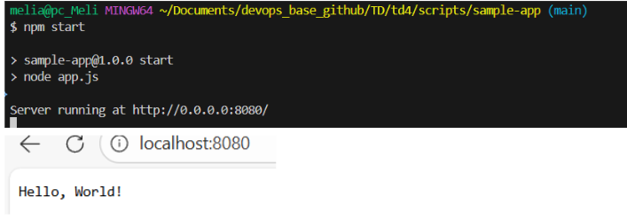

L'étape suivante a consisté à "dockeriser" l'application. Pour cela, j'ai créé un Dockerfile définissant l'environnement d'exécution. Pour automatiser la création de l'image, j'ai rédigé un script Bash build-docker-image.sh qui récupère le nom et la version du projet depuis le package.json. J'ai ensuite lié ce script à NPM via la commande npm run dockerize.

J'ai appris également que pour qu'une application soit accessible depuis l'extérieur d'un conteneur, elle doit écouter sur 0.0.0.0 et non sur 127.0.0.1.

Après l'exécution du code, j'ai vérifié la présence de l'image en local avec la commande docker images. L'image sample-app apparaît bien avec le tag de version correspondant, ce qui confirme que le processus de build automatique est fonctionnel.

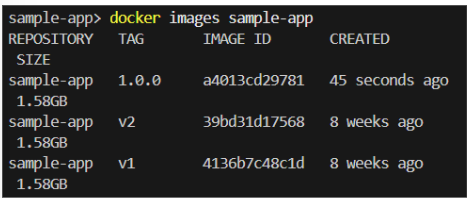

Exercices : 

Pour le premier exercice, nous avons remplacé node:latest par node:21.7 dans le Dockerfile. Utiliser une version précise permet de garantir que l'application fonctionnera toujours de la même manière. Si on laisse "latest", une mise à jour automatique de Node.js pourrait faire planter le projet du jour au lendemain. Cela rend aussi le debug plus facile car on connaît exactement l'environnement utilisé.

Pour le deuxième exercice, nous avons ajouté la commande "docker:run": "docker run -p 8080:8080 sample-app:1.0.0" dans le fichier package.json. Grâce à cela, nous n' avons plus besoin de taper de longues commandes Docker compliquées, tout se fait grâce à NPM. Le cycle complet (préparer, créer l'image, lancer) est maintenant automatisé, ce qui évite les erreurs de frappe. 

## Partie 4 : Gestion des dépendances avec NPM et Express.js 

Dans cette partie, nous avons fait évoluer l’application en utilisant Express.js , qui permet de simplifier énormément la création de serveurs web par rapport au module HTTP natif de Node.js. 

Tout d’abord nous avons commencé par installer Express avec la commande npm install express. Cela a automatiquement mis à jour le fichier package.json. On a ensuite réécrit app.js pour utiliser ce framework. Le code est désormais plus lisible et permet de gérer facilement le port via une variable d'environnement (process.env.PORT), ce qui est une bonne pratique en DevOps pour rendre l'application configurable sans modifier le code.

Pour ajouter les nouvelles bibliothèques, j'ai optimisé le Dockerfile en y ajoutant le fichier package-lock.json. Cela garantit que les versions des dépendances installées restent strictement identiques à chaque build, assurant ainsi la stabilité de l'application. La modification la plus importante est l'utilisation de la commande npm ci --only=production.

Cette option permet d’exclure les outils de test ou de développement pour ne conserver que le strict nécessaire au fonctionnement du serveur. Ce qui permet de rendre l’image Docker finale beaucoup plus légère plus rapide à construire et plus sécurisée (car contient moins de paquets superflus) 

Exercices : 

Nous avons ensuite créé une nouvelle page sur notre serveur : /name/:name. Elle permet de répondre un message personnalisé selon le nom écrit dans l'adresse. Par exemple, si on va sur http://localhost:8080/name/Meliana, le serveur affiche "Hello, Meliana!". Cela montre comment Express peut récupérer des informations directement depuis l'URL.

Nous avons ensuite appris à séparer les outils dans le lab, les dependencies qui sont les outils obligatoires pour que l’application marche (comme Express) et les devDependencies qui sont les outils qui servent qu’au développeur sur son propre PC. 

En séparant les deux, on évite d'alourdir l'application finale avec des fichiers qui ne servent à rien pour l'utilisateur.

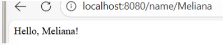

## Part 5 : Automatisation des tests avec Jest et Supertest 

Dans cette partie nous allons apprendre comment améliorer la qualité du code. L’objectif c’est de mettre en place des tests automatisés pour vérifier que l’application fonctionne correctement après chaque modification ce qui permet d’éviter l’apparition de bugs. 

Pour tester l’application sans lancer réellement le serveur nous avons installé deux outils, Jest et Supertest. On a ensuite séparé le code en deux fichiers app.js qui contient la logique de l’app et server.js qui s’occupe uniquement du démarrage. 

On a ensuite écrit des tests dans un fichier app.test.js afin de vérifier que la page d’accueil et la route renvoient les bonnes réponses.  En lançant la commande npm test, Jest vérifie automatiquement toutes les conditions définies.

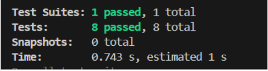

Exercices : 

Nous avons ajouté une nouvelle route /add/:a/:b qui permet d'additionner deux nombres. Pour rendre l'application plus robuste, nous avons ajouté une validation, si les entrées ne sont pas des nombres, l'application renvoie une erreur au lieu de planter. Nous avons créé des tests spécifiques pour vérifier le calcul. 

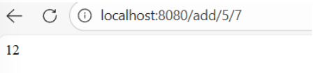

Grâce à Jest, nous avons généré un rapport de “Code Coverage”. Cet outil permet de mesurer le pourcentage du code réellement testé. Une couverture de 100% signifie que chaque ligne du code a été exécutée au moins une fois par les tests, plus la couverture est haute et moins il y a de risques de comportements étranges imprévus du code. 

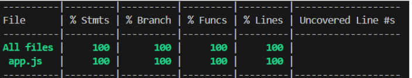

## Partie 6 : Tests automatisés pour l’infrastructure (OpenTofu)

Dans cette partie nous allons appliqué les principes du test automatisé non pas au code de l’application mais à l’infrastructure elle même. En utilisant OpenTofu nous avons pu vérifier que les ressources déployées sur le cloud fonctionnent comme prévu.

OpenTofu va déployer l'infrastructure, exécuter les tests de validation et va tout détruire pour éviter les coûts inutiles. Pour cela nous avons utilisé un fichier de test deploy.tftest.hcl. Ce fichier contient les instructions pour envoyer des requêtes HTTP à l’URL crée par AWS et vérifier que la réponse du serveur est bien “Hello World”.  

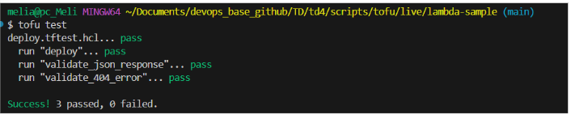

Exercices : 

Tout d’abord nous avons modifié la fonction Lambda pour qu'elle réponde en format JSON (par exemple : {"message": "Hello, World!"}) au lieu de simple texte. J'ai ensuite mis à jour mes tests OpenTofu pour vérifier que le format reçu est correct et que le message est le bon. 

Pour le second exercice, nous allons devoir vérifier que les erreurs sont bien gérées. On a donc créé un test négatif, la Lambda est configuré pour qu’elle renvoie une erreur 404 si on essaie d’accéder à une page qui n’existe pas. Cela permet de garantir que les utilisateurs reçoivent une réponse propre même dans le cas de mauvaise adresse. 

## Partie 7 : Bonnes pratiques de test 

Pour finir,nous avons suivi le principe de la pyramide des tests, qui consiste à multiplier les tests simples et rapides (unitaires) avant de passer aux tests plus compliqués.

Exercices : 

Tout d’abord nous avons testé la méthode TDD, qui demande d’écrire le test avant de coder la fonctionnalité. Nous avons commencé par créer les tests pour une nouvelle route de multiplication '/multiply/:a/:b'. Au début les tests ont échoué puis lorsque l’on a codé la fonction dans app.js les tests sont passés au vert. Cette technique est intéressante car elle nous oblige à bien réfléchir au fonctionnement que l’on souhait avant même de commencer à programmer. 

Ensuite on a analysé la “couverture” des tests pour vérifier si certaines parties du code étaient oubliées. Le rapport final affiche 100%, cela signifie encore que chaque ligne a été vérifiée par au moins un test. 

## Conclusion : 

Ce lab a permis de mieux comprendre la chaîne devOps, en partant de la sécurisation des commits, à la création d’images Docker, jusqu’au déploiement et aux tests automatisés sur le cloud avec OpenTofu. NPM permet de simplifier toutes ces tâches et rend le travail en équipe beaucoup plus fiable 
