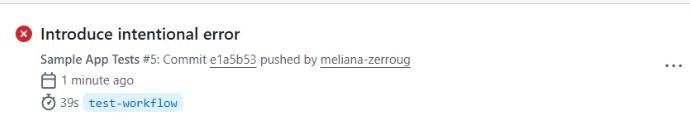
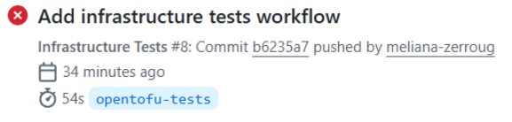
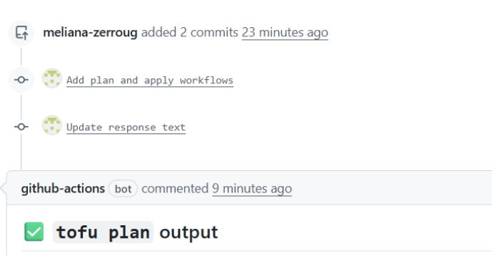
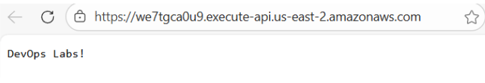

# Lab 5 : Intégration Continue et Déploiement Continu (CI/CD)

## Introduction 

L’objectif de ce TP est de mettre en place un pipeline automatisé d’intégration et de déploiement continu ( CI/CD). Pour se faire nous allons utiliser GitHub Actions pour l’automatisation, OpenTofu pour l’infrastructure (IaC) et AWS comme fournisseur cloud. 

## Partie 1 : Intégration continue

Tout d’abord nous avons du récupéré l’application de test du lab précédent pour servir de base à nos tests. Ensuite, nous avons configuré GitHub Actions en créant un dossier à la racine. 
Ce fichier permet de dire à GitHub que dès qu’il y a un push il faut lancer une machine Ubuntu, installer les dépendances ( avec npm install)  et lancer les tests (avec npm test). 

Ensuite nous avons vérifié que l’automatisation fonctionnait correctement. Tout d’abord on a ajouté les fichiers sur la branche main et on les a ensuite ebvoyé sur GitHub. 

Ensuite nous avons simulé une erreur, nous avons créé une nouvelle branche “test-workflow” pour ne pas casser le projet principal. Puis nous avons modifié le fichier app.js en changeant le texte de réponse par “DevOps Labs!”. En envoyant ce code et en ouvrant une PR le workflow s’est lancé et a échoué comme prévu. En effet cela est normal car le code a changé mais pas le test. 

Pour réparer le pipeline, nous avons modifié le fichier de test app.test.js pour qu'il accepte le nouveau texte "DevOps Labs!". Après avoir push la correction, GitHub Actions s'est relancé tout seule et ça a pu repasser au vert. 

Cela nous permet de comprendre l’intérêt de l’intégration continue. On voit tout de suite si une modification casse l’application avant même de fusionner le code, cela permet de garder un code toujours fonctionnel sur la branche principale. 

L'objectif de cette étape est de permettre à GitHub Actions de communiquer avec mon compte AWS pour déployer des ressources, mais sans utiliser de clés d’ Access Keys. On a mis en place un OIDC ce qui permet de générer des jetons temporaires et sécurisés. 

Pour automatiser cette configuration nous avons fait avec OpenTofu. Tout d’abord nous avons créé un module dans TD/td5/scripts/tofu/live/ci-cd-permissions/main.tf pour déclarer GitHub comme une source de confiance pour AWS. Et ensuite il a fallu configurer des rôles spécifiques dans le module iam_roles. 

Une fois le code prêt on a initialisé et appliqué la configuration. 
Après validation, OpenTofu nous a retourné plusieurs identifiants uniques AWS pour nos rôles. Ces ARN sont essentiels car ce sont eux que GitHub utilisera pour  les permissions nécessaires lors des prochains pipelines.

Ensuite nous allons maintenant vérifier que le code OpenTofu est valide et qu’il crée bien les ressources attendues sur AWS avant de les déployer. 
Afin de permettre des tests isolés on a dû modifier le code Terraform. On a ajouté une variable name dans un fichier variables.tf . Cela permet au pipeline de tests de donner un nom unique pour chaque ressource afin d'éviter que deux tests lancés en même temps essaient de créer la même ressource sur AWS. 

On a ensuite créé un nouveau fichier de workflow pour automatiser ces tests. 
Lors du premier lancement du workflow infra-tests.yml, nous avons rencontré une erreur à cause des accès. Le rôle utilisé par GitHub ne possédait pas les droits qui permettent de créer les politiques de logs de la fonction Lambda. 

Plutôt que d’utiliser la facilité comme IAMFullAccess, nous avons opté pour l’approche du moindre privilège. Nous avons limité les permissions iam:PutRolePolicy et iam:DeleteRolePolicy uniquement pour les ressources dont le nom commence par lambda-sample*

Une fois que la sécurité à été ajustée, le workflow GitHub Actions s'est exécuté avec succès. La commande tofu test -verbose permet de déployer temporairement l'infrastructure, de vérifier la validité des configurations et enfin de détruire automatiquement les ressources après validation pour éviter les coûts inutiles. 

## Partie 2 : Déploiement Continue (CD) : 

Le déploiement continu va permettre de rendre les déploiements rapides et fiables. 

Par défaut OpenTofu va stocker l’état de l’infrastructure sur mon pc local cependant cela est risqué et impossible à utiliser en équipe. Nous avons donc créé un module tofu-state pour mettre en place un Remote Backend sur AWS, un bucket S3 qui va stocker le fichier d’état et une table DynamoDB qui va permettre d’empêcher deux personnes (ou pipelines) de modifier l’infrastructure en même temps ce qui va permettre d’éviter de corrompre les ressources.

Après avoir créé le fichier backend.tf nous avons initialisé le backend; OpenTofu a detecté l’état local et a proposé de le copier vers le bucket S3. Cela permet à GitHub Actions de pouvoir accéder à l’état de notre infrastructure pour effectuer des modifications. 

Puis pour que GitHub Actions puisse déployer l’application, il faut certaines permissions, nous avons donc mis à jour le module ci-cd-permissions afin de créer deux rôles différents; le rôle plan qui permet de lire l’état actuel et de proposer des changements sans rien modifier. Le rôle apply qui possède les droits d’écriture pour appliquer les changements sur AWS. 

On lance ensuite tofu apply dans le dossier ci-cd-permissions puis on récupère les ARN nécessaires : 

L’étape finale consiste à automatiser totalement le le cycle de l’infrastructure. L’idée est que lorsqu’il y a une modification du code cela déclenche une série d’actions automatiques tout en communiquant directement dans l’interface de GitHub. 

Pour cela on a mis en place deux fichiers de workflow GitHub Actions, le tofu-plan.yml pour la prévisualisation et tofu-apply.yml pour le déploiement. 

Pour valider le pipeline nous avons dû changer le message de retour de la fonction par “DevOps Labs!”. 

Lorsque l’on a ouvert la pull request, le workflow tofu-plan s’est déclenché. On a pu vérifiéer que OpenTofu prévoyait bien une mise à jour de la fonction Lambda. 

Voici les fichiers modifiés : 

Après avoir fusionné la PR, le workflow tofu-apply a pris le relais sur la branche main. Ce pipeline a communiqué avec AWS via OIDC pour déployer la nouvelle version du code. Le succès de cette étape confirme que nos rôles IAM sont correctement configurés et que le Remote Backend (S3) a bien été mis à jour. 

Enfin nous avons pu récupérer l'URLS publique générée par l'API Gateway. On peut voir que le message s'affiche correctement.

Cela nous montre qu’avec un simple git push on a pu tester l’application, vérifier l’impact sur l’infrastructure et mettre à jour le service cloud de manière totalement automatisée et sécurisée.

Pour aller plus loin on pourrait faire une généralisation du pipeline, actuellement il est limité au dossier lambda-sample, le workflow pourrait utiliser l’action changed-files pour détecter n’importe quel module OpenTofu modifié dans le dépôt. 

On pourrait également réaliser une “matrix Strategy”, afin de réduire les temps de déploiement lors de grosses modifi	cations Cette stratégie permettrait de lancer les phases de plan et apply sur plusieurs dossiers en même temps. 

## Conclusion : 

Pour conclure ce TP, nous avons appris à mettre en place une chaîne DevOps complète, de l'écriture du code jusqu'au déploiement automatique sur AWS. Ce que nous retenons surtout, c'est l'importance de l'Infrastructure as Code (IaC) avec OpenTofu. Le fait de passer sur un "Remote Backend" avec S3 et DynamoDB change tout : ça permet de travailler en équipe sans risquer de casser l'état de l'infrastructure ou de s'embrouiller entre deux modifications.
La partie la plus intéressante a été la sécurisation du pipeline. Au lieu d'utiliser des mots de passe ou des clés AWS qui peuvent fuiter, nous avons utilisé OIDC pour que GitHub et AWS se fassent confiance automatiquement. Nous avons aussi appris à gérer les rôles IAM de façon précise. Même si nous avons eu quelques erreurs d'accès au début, nous avons compris qu'il vaut mieux donner juste les bonnes permissions (le "moindre privilège") plutôt que de donner tous les droits, ce qui est bien plus sûr pour une entreprise. 
Enfin, l'automatisation avec GitHub Actions rend le travail beaucoup plus rapide.Une fois que nous avons fait le "merge", voir que l'application se met à jour toute seule sur le navigateur (avec le message "DevOps Labs!") prouve que le système est fiable. Cela permet de gagner énormément de temps et ça évite les erreurs manuelles qu'on pourrait faire en configurant tout à la main sur la console AWS.
