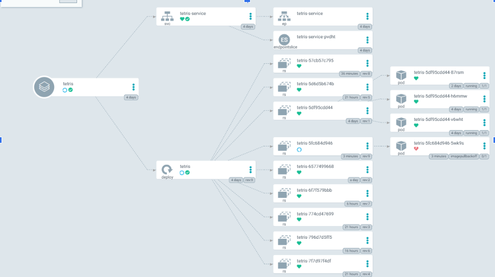
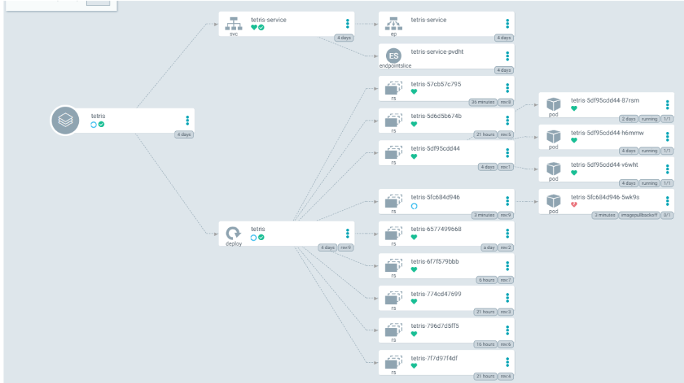
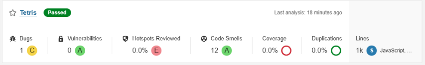
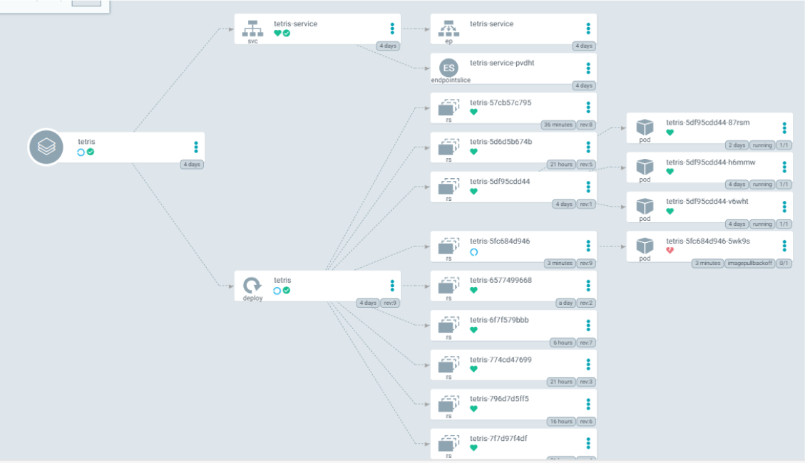
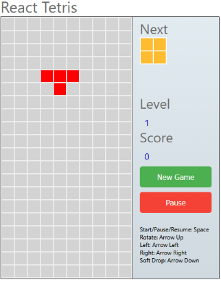
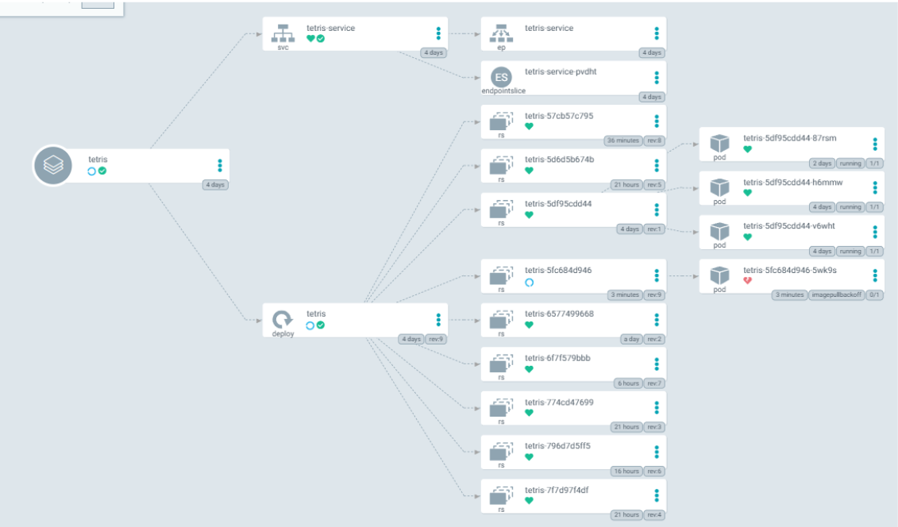

# Introduction

Ce projet met en place une chaîne **DevSecOps** complète pour déployer deux versions d’une application Tetris sur AWS EKS.

Pour cela nous allons utiliser plusieurs services et applications : 
- provisionnement d’infrastructure avec **Terraform**,
- intégration continue avec **Jenkins**,
- contrôle qualité et sécurité,
- build d’images **Docker**,
- déploiement **Kubernetes** sur **EKS**

# Description

## Structure du projet et rôle de chaque dossier

### `EKS-TF/`

Contient l’Infrastructure as Code Terraform pour AWS EKS :

- VPC et réseau,
- cluster EKS,
- node groups,
- rôles/politiques IAM,
- variables et backend d’état Terraform.

## Flux technique global

1. Terraform crée l’infrastructure AWS (Jenkins, EKS, IAM, VPC).
2. Jenkins exécute les pipelines CI/CD.
3. Le code est analysé (qualité/sécurité), puis conteneurisé.
4. L’image est déployée sur Kubernetes (EKS) via manifests.
5. L’application Tetris est exposée via Service/Ingress.

## Outils DevSecOps utilisés

- **Terraform** : provisioning infrastructure.
- **Jenkins** : orchestration CI/CD.
- **Docker** : conteneurisation applicative.
- **Kubernetes (EKS)** : orchestration de déploiement.
- **SonarQube / Trivy / Dependency-Check** (selon pipeline) : qualité et sécurité.

## Réalisation du projet

Pour ce projet, nous avons tout d’abord importé toutes les données dans notre repository GitHub. Le dossier du projet contient déjà les fichiers nécessaires à l’exécution du projet à l'exception de certaines modifications à faire pour adapter les fichiers à notre GitHub.

Nous avons ensuite créé un utilisateur IAM spécifique au projet. Cet utilisateur avait les droit administrateur pour lui permettre de créer, modifier et supprimer des instances. Une fois créé, nous lui avons générer des clés d’accès pour pouvoir utiliser la ligne de commande dans les instances qui seront créées ensuite, mais aussi un bucket. 

Une fois fait nous avons déployé le serveur Jenkins en utilisant Terraform. Nous avons donc planifié le serveur que l’on voulait lancer pour avoir une base et savoir si nos instances supporteraient Jenkins. Une fois fait nous avons apply ce qui avait été planifié avant créant 5 instances, la principale sur laquelle nous nous connections et les autres gérant les nœuds et les pods. 

Ensuite, il fallait configurer Jenkins. Tout d’abord, en se connectant et en vérifiant que toutes les dépendances étaient présentes, ce qui n’était pas le cas lors de la première exécution. En se connectant sur le port 8080 de notre “instance principale” nous avons pû accéder à l’interface graphique de Jenkins.

Sur cette interface nous avons dans un premier temps déployé le Cluster EKS qui nous servira de base pour créer les services que nous utiliserons lors du déploiement de nos applications. Pour cela nous avons d'abord installé les plugins manquant, ajouté la clé sécurisée de l’utilisateur créé plus tôt AWS, créé notre premier job, une pipeline, appliqué la bonne configuration et exécutée celle-ci. Après la correction de quelques erreurs, le serveur EKS était lancé. Nous avons ensuite configuré notre nouveau serveur. 

Pour lancer notre application, il ne restait plus qu’à configurer les dernières étapes étant ArgoCD, SonarQube et la configuration de l’installation des plugins.

Pour ArgoCD, nous nous sommes connecté au lien fourni par le load balancer que le serveur EKS avait créé. Il a ensuite fallu récupérer le mot de passe pour accéder à l’interface d’ArgoCD. 
Nous avons donc pu créer l’application qui se lie à notre GitHub pour pouvoir observer celle-ci une fois déployé.

Pour SonarQube, nous avons lancé son container docker sur le serveur pour y avoir accès.
Cela nous a permis de générer un token et un webhook et de configurer les deux sur Jenkins ensuite.

Après quelques configurations Jenkins, le job et donc la pipeline de TetrisV1 étaient prêts pour le déploiement. Pour déployer la V2, il a suffi d’une modification dans le fichier de manifest “deployement-service.yml” et de la création d’un nouveau job, et le deuxième site était prêt.

## Difficultés

Durant la réalisation du projet, nous avons fait face à des difficultés. Pour ne pas utiliser de services payants nous avons utilisé seulement des instances **t3.small**, mais le tutoriel utilise lui des instances **t3.medium**. Nous avons donc dû contourner ce problème en utilisant 4 instances supplémentaires pour former nos nœuds et nos pods. Pour l’implémentation complète nous avons aussi dû libérer un pod du service de notification jugé non utile pour notre implémentation de Tetris. 

Un autre problème lié à notre volonté de rester dans le service gratuit d’AWS, est un manque de puissance constant dans l'exécution des pipelines. Leur exécution prend souvent plus d’une heure qui pose problème pour réaliser des tests ou effectuer des corrections. Le manque de mémoire causait aussi certaines erreurs lors de l’exécution puisque Jenkins est lourd pour des instances si petites.

Finalement nous avons réussi à contourner ces problèmes pour déployer les deux versions de Tetris.

## Résultat 

Le projet montre une implémentation pratique d’une chaîne DevSecOps cloud-native :

- reproductible,
- automatisée,
- orientée sécurité,
- déployée sur AWS EKS.

Nous pouvons retrouver notre application déployée sur ArgoCD : 

Cela nous a permis de générer un token et un webhook et de configurer les deux sur Jenkins ensuite.

Après quelques configurations Jenkins, le job et donc la pipeline de TetrisV1 étaient prêts pour le déploiement. Pour déployer la V2, il a suffi d’une modification dans le fichier de manifest “deployement-service.yml” et de la création d’un nouveau job, et le deuxième site était prêt.

## Difficultés

Durant la réalisation du projet, nous avons fait face à des difficultés. Pour ne pas utiliser de services payants nous avons utilisé seulement des instances **t3.small**, mais le tutoriel utilise lui des instances **t3.medium**. Nous avons donc dû contourner ce problème en utilisant 4 instances supplémentaires pour former nos nœuds et nos pods. Pour l’implémentation complète nous avons aussi dû libérer un pod du service de notification jugé non utile pour notre implémentation de Tetris. 

Un autre problème lié à notre volonté de rester dans le service gratuit d’AWS, est un manque de puissance constant dans l'exécution des pipelines. Leur exécution prend souvent plus d’une heure qui pose problème pour réaliser des tests ou effectuer des corrections. Le manque de mémoire causait aussi certaines erreurs lors de l’exécution puisque Jenkins est lourd pour des instances si petites.

Finalement nous avons réussi à contourner ces problèmes pour déployer les deux versions de Tetris.

## Résultat 

Le projet montre une implémentation pratique d’une chaîne DevSecOps cloud-native :

- reproductible,
- automatisée,
- orientée sécurité,
- déployée sur AWS EKS.

Nous pouvons retrouver notre application déployée sur ArgoCD : 

Nous obtenons le lien pour acceder à [Tetris V1](http://a1b2c8be2b5494a05ae1e8bddbceef33-1899199155.us-east-1.elb.amazonaws.com/).

Notre projet est aussi présent sur Sonarqube : 

En cliquant sur le lien, nous arrivons sur la page suivante sur laquelle il est possible de jouer à Tetris : 

## Limites actuelles du projet

Dans sa forme actuelle, le projet se concentre surtout sur l’automatisation. Cependant il y a tout de même des limites qui sont :

Observabilité partielle : métriques et logs pas totalement centralisés, traçabilité limitée ;
Sécurité dépendante de la bonne configuration du pipeline ;
Procédure de rollback non clairement définie ;
Pas de tableau de bord unique regroupant tous les indicateurs clés.

## Améliorations recommandées

- Ajouter des **quality gates bloquantes** (qualité + sécurité) avant déploiement.
- Versionner et automatiser la gestion des secrets (KMS/Secret Manager/External Secrets).
- Standardiser les stratégies de tags d’images et de promotion d’environnements.

## Conclusion 

Ce projet représente une base intéressante pour illustrer la mise en place d’un pipeline DevSecOps cloud-native sur AWS. Il intègre les composantes fondamentales telles que l’Infrastructure as Code (IaC), l’intégration et le déploiement continus (CI/CD), la conteneurisation et l’orchestration avec Kubernetes. Il constitue ainsi un environnement permettant d’évaluer la performance opérationnelle, de renforcer la sécurité et d’améliorer la fiabilité du cycle de livraison logicielle.

